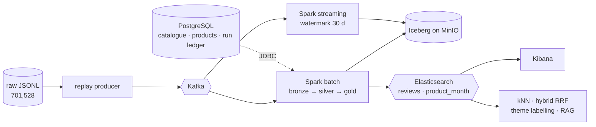

# Review Radar — design document

BIU 8688697201, Big Data and AI, final project (solo). Links rather than appendices: nothing
here is restated from an ADR, a gate artefact or the [README](../README.md).

## 1. The question, and who asks it

Fixed before any analysis ran ([ADR-0001](adr/0001-temporal-holdout-and-protocol-freeze.md)):

> **Which products experienced a sustained decline in customer ratings, and which complaint
> themes increased during that decline?**

A category manager asks it — they own a shelf and want a shortlist, not a model. Amazon Reviews
2023, `All_Beauty`: **701,528 reviews, 112,590 products, 631,986 users, 2000-11-01 →
2023-09-09**.

## 2. The data, and which V's it exercises

| V | the measured figure |
|---|---|
| **Volume** | 0.54 GB raw JSONL; **311 MB → 96.5 MB** Parquet in bronze (**3.2×**); 693,547 ES docs; 345,418 vectors |
| **Velocity** | producer **232,000–484,000 rec/s** — a range, because the host is shared and a point estimate would not reproduce; the P8 replay paces to a frozen **3,000 rec/s**, measured **2,999** |
| **Variety** | free text; a `details` dict whose keys collide case-insensitively; `price` as `null` / `"9.99"` / `"$9.99"` / a range; `products` joined over JDBC |
| **Veracity** | `(user, product, timestamp)` collides in **6,139 groups over 13,415 rows** — 6,138 byte-exact, 1 conflicting on `helpful_vote`, **0 disagreeing on rating** → 7,276 removed |

## 3. Architecture and data flow

PostgreSQL does three jobs: the **Iceberg catalogue** (the transactional pointer swap an object
store cannot do, having no atomic rename), the **relational enrichment source** broadcast-joined
into silver every run, and `pipeline_runs`, the **run ledger** whose `run_id` is stamped into
every snapshot, ES doc and eval artefact ([ADR-0008](adr/0008-run-ledger-as-lineage.md)).
**Exactly-once, as a figure:** `make eos` loads 120,000 records, `SIGKILL`s bronze mid-stream,
restarts from the checkpoint — **89,964 rows before the kill, 120,000 after, 0 duplicate
`(partition, offset)` pairs** ([transcript](demo/2026-09-14-4/exactly-once.txt)).

## 4. The pipeline, phase by phase

One row per capability in [`conf/lineage_chain.toml`](../conf/lineage_chain.toml), carrying what
`make eval-table` prints today; `tests/test_written_deliverables.py` fails if the two disagree.
`PASS`/`FAIL` is a *reproducibility* claim only — quality prints its own verdict and never
reopens a phase ([ADR-0011](adr/0011-phase-gates-print-a-number-and-only-reproducibility-blocks.md)).

| phase | capability | gate | verdict | the number, or the written reason |
|---|---|---|---|---|
| P2 Silver | `silver` | `SILVER_GATE` | **PASS** | 8/8 · 701,528 → 694,252 rows, 0 rejects |
| P2 Silver | `silver_repro` | `SILVER_REPRO_GATE` | **PASS** | 13/13 · re-derived in pandas, no shared code |
| P3 Gold | `gold` | `GOLD_GATE` | **PASS** | 3/3 · 473,268 product-months, 964 alerts = 964 episodes |
| P3 Gold | `gold_repro` | `GOLD_REPRO_GATE` | **PASS** | 10/10 · 0 mismatched fields |
| P3 Gold | `gold_calibration` | `GOLD_CALIBRATION` | **MISSING** | no artefact **and** no `cut_reason` — the freeze has not happened, so `make eval-table` exits non-zero |
| P3 Gold | `gold_analytical` | `GOLD_ANALYTICAL` | **REPORTED** | 964 alerts on 757 of 1,599 evaluable products, development only |
| P4 Search | `search` | `SEARCH_GATE` | **PASS** | 7/7 · 693,547 + 473,268 docs, 7/7 analyzer cases |
| P5 Embeddings | `embeddings` | `EMBED_GATE` | **PASS** | 7/7 · 345,418 vectors, ANN recall@10 0.96 |
| P6 Themes | `themes` | `THEMES_GATE` | **PASS** | 7/7 · taxonomy frozen, audit set opened once, 200/200 |
| P6 Themes | `themes_quality` | `THEMES_QUALITY` | **FAIL** | macro-F1 **0.4583** vs bar 0.70 — §7 |
| P6 Themes | `themes_agreement` | `THEMES_AGREEMENT` | **NOT_RUN** | the blind 50 are drawn and exported, not yet hand-labelled |
| P6 Themes | `themes_repeat_kappa` | `THEMES_REPEAT_KAPPA` | **NOT_RUN** | cut: a deterministic labeller has no repeat kappa |
| P7 RAG | `rag` | `RAG_GATE` | **PASS** | 8/8 · 30/30 answered; 29/30 clear the reported contract |
| P7 RAG | `rag_quality` | `RAG_QUALITY` | **NOT_RUN** | 0/30 judged; the four targets stay unmeasured |
| P8 Stream | `stream_control` | `STREAM_GATE` | **PASS** | 11/11 · 193,939 product-months vs gold, 0 differing |
| P8 Stream | `stream_demo` | `STREAM_GATE` | **PASS** | 18/18 · 2,000 far-slice rows dropped exactly, 1,322 diffs all explained |
| Lineage track | `lineage` | `LINEAGE_GATE` | **PASS** | 7/7 · `chain_clean=true` over 95 links |
| Deliverables track | `demo` | `DEMO_GATE` | **PASS** | 5/5 · 2 rehearsals, 259 s of 300 s, 4/4 documents |

A capability is either a number or a written reason; the command exits non-zero on one that is
neither — as it does today, on `gold_calibration`.

## 5. The AI capability, and why this one

The course names the gap in deck 5: `BM25 does not consider the semantic meaning of the query
terms or the documents`. P5 measures it in the same engine — **345,418** MiniLM-L6-v2 vectors
over the ≥ 20-word cohort, identity hashed over meaning-changing settings only
([ADR-0005](adr/0005-embedding-identity-and-client-side-hybrid.md)), indexed beside BM25, with
`hybrid` fusing the two rankings client-side by RRF. **ANN recall@10 0.96**; **H-E1 is not
held**, H-E2 and H-E3 are ([decision](decisions/embeddings-retrieval.md)). Above it: a frozen
ten-theme **complaint** taxonomy — a theme set per review, not a polarity
([ADR-0003](adr/0003-frozen-complaint-theme-labelling.md)) — and **RAG** with claim-level
citations over the same retriever ([ADR-0006](adr/0006-frozen-rag-evaluation-protocol.md)),
labelled by local `qwen3:8b` because `ANTHROPIC_API_KEY` is empty.

## 6. Results and insights

**The headline is narrower than the question, deliberately.** `conf/decline_rule.toml` is still
`provisional`, so the gold job *refuses* any evaluation point on or after the `2020-01` holdout
start: **757 of 1,599 evaluable products** raised at least one sustained-decline alert before
2020-01 — 964 alerts, 964 episodes, over a 473,268 product-month spine and 217,325 points, with
episodes closed by recovery 555, gap 275, end of data 134. The holdout claim — *N of M during 2020–2023 under a rule applied unchanged* —
**does not exist yet**, because the protocol freeze has not happened. Worked example (demo move
7): `B00RPJZMUM`, an ionic hair dryer at decline rank 3, where `hard_to_use` and
`not_as_described` in 2016-10…2017-03 give way to `does_not_work` (*"motor stopped working"*) in
2017-04…2017-09. **An alert is not causal proof**, and a shift over 18 baseline and 3 recent
labelled mentions illustrates; it does not estimate.

## 7. How we avoided fooling ourselves

A **temporal holdout and protocol freeze** enforced in code, not left to the analyst;
**reproducibility separated from outcome**, with two gates re-deriving the tables in pandas
importing nothing from the Spark jobs (13 and 10 checks, 0 mismatched fields); **bars set before
the measurement and not moved** — when the labeller dropped from hosted Haiku to a local 8B
model, 0.70 stayed 0.70; and **every number joined back to a run**, `make gate-lineage` printing
how many links it walked (`chain_links_checked=95`) so a pass over an empty chain is impossible.

**P6's outcome, stated as the miss it is.** On the once-opened, held-out audit set of 200 reviews
the labeller scores **macro-F1 0.4583 [0.3647, 0.5223]** against **0.70** → `THEMES_QUALITY=FAIL`,
blocking nothing. Scored on the same pass: the MLlib classifier **0.3899 [0.3074, 0.4639]** and
the **star-only floor 0.2968 [0.2612, 0.3493]**. The labeller's interval and the floor's are
**disjoint** — distinguishably better than predicting themes from the star rating — whereas the
**classifier's overlaps the floor** and is not. On development the labeller and the floor
overlapped; the holdout *reverses* that smaller-sample reading rather than confirming it. 27 of
200 labellings failed to parse (13.5%), each scoring as an empty prediction, so part of the gap
precedes any judgement about themes.

## 8. Trade-offs, and what was declined out loud

**Three trade-offs.** **Iceberg is not a course technology** — one mention in ~860 slides,
conceded up front. **Local `qwen3:8b` instead of hosted Haiku**, with the 0.70 bar deliberately
unmoved, so the constraint surfaces as a reported miss rather than a relaxed target. **Public
but sensitive review text** — only title and text cross the wire to the model, never `user_id`s.

**Four declines, in the wording that binds them.**

- **Kafka Connect Elasticsearch sink — dropped for time.** Not argued from the deck's
  `Except for a trivial "file" connector` line, which covers a Connect *source*; the deck
  separately names an Elasticsearch sink. The schedule decided this, not the merits.
- **Single-node HDFS — declined on resources, conceding that MinIO is not equivalent:** block
  replication and rack awareness against a flat key space with no atomic rename.
- **Sqoop and Pig — on the course's own slide:**
  `Apache Sqoop moved into the Attic in June 2021`; Spark SQL does Pig's transform.
- **Oozie — declined as an opinion, and owned as one.** Spark subsumes the orchestration and the
  run ledger fills the role, but Oozie is not retired and the decks teach it across 25 mentions.
  GraphFrames/GraphX go the same way, as a detour.
